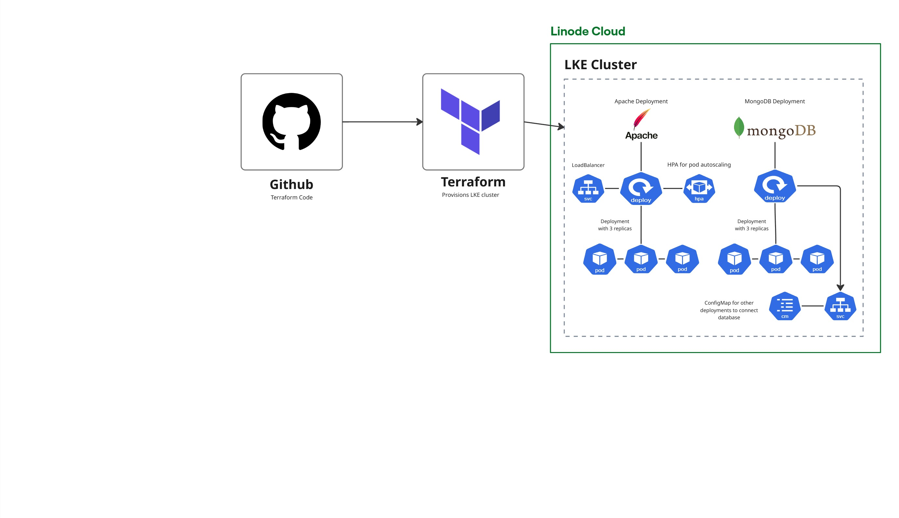

# LKE Cluster Deployment with Terraform


## Overview

Deployed a full Kubernetes stack on Linode Kubernetes Engine (LKE) entirely through Terraform. The project covers cluster provisioning, application deployment (Apache + MongoDB), credential management, and Horizontal Pod Autoscaling — all defined as infrastructure code using the Linode Terraform provider.

## Architecture



The deployment flow:
- **Terraform** provisions the LKE cluster on Linode via the Linode provider
- **Apache** deployed as a Kubernetes Deployment + Service via Terraform
- **MongoDB** deployed with credentials configured and a ClusterIP Service
- **HPA** configured to autoscale Apache pods based on an External latency metric (scales when latency exceeds value 20)

## Tech Stack

| Layer | Technology |
|-------|-----------|
| Cloud platform | Linode (Akamai Cloud) |
| Kubernetes engine | LKE (Linode Kubernetes Engine) |
| Infrastructure as Code | Terraform + Linode provider |
| Web server | Apache |
| Database | MongoDB |
| Autoscaling | Kubernetes HPA |

## What Was Built

**1. Linode Terraform provider setup**
- Researched and configured the Linode provider for Terraform
- Set up authentication and provider version pinning

**2. LKE cluster provisioned with Terraform**
- Defined node pools, Kubernetes version, and region in Terraform
- Full cluster lifecycle managed as code

**3. Apache deployment via Terraform**
- Kubernetes `Deployment` and `Service` resources written in Terraform
- Exposed via LoadBalancer service

**4. MongoDB deployment with credentials**
- MongoDB `Deployment` and `Service` deployed via Terraform
- Database credentials configured securely within the manifest

**5. Horizontal Pod Autoscaler**
- HPA configured via Terraform using an **External latency metric** — scales Apache pods when latency exceeds value 20
- Min replicas: 1, Max replicas: 10

## Deployment Notes

> **Two-step deployment required** — this is a known Terraform provider initialization constraint.

Terraform initializes providers before creating any resources. On the first run the LKE cluster doesn't exist yet, so the Kubernetes provider has no kubeconfig to connect to.

**Step 1 — Provision the cluster:**
```bash
terraform apply -target=linode_lke_cluster.foobar
terraform output -raw kubeconfig | base64 -d > kubeconfig.yaml
```

**Step 2 — Deploy everything else:**
```bash
# Set kubeconfig_path = "kubeconfig.yaml" in terraform.tfvars
terraform apply
```

## Credentials & Security

MongoDB credentials are passed via **Kubernetes Secrets** — never hardcoded in the codebase.

```bash
# Copy the example and fill in your values
cp terraform.tfvars.example terraform.tfvars
```

`terraform.tfvars` is in `.gitignore` and should never be committed.

## Project Structure

```
02-linodeTerraform-DEVOPS/
├── main.tf          
├── variables.tf
├── terraform.tfvars
├── .gitignore
└── README.md
```

## Key Learnings

- Terraform provider initialization runs before resource creation — provisioning a cluster and deploying to it in one step requires a two-stage apply
- Managing Kubernetes resources directly through Terraform instead of kubectl
- Passing sensitive credentials via Kubernetes Secrets referenced in env vars — never hardcoded
- HPA with External metrics for latency-based scaling, not just CPU
